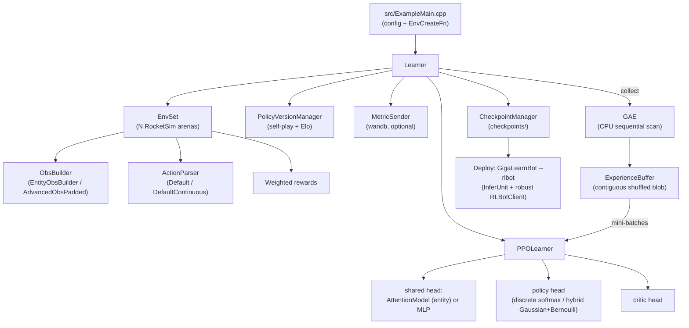

# GigaLearnRL Architecture

This document explains how the framework fits together and what was unified/cleaned when merging
the two source lineages (the discrete/MLP "Leak" and the continuous+attention fork).

## High-level data flow



## Components

| Component | Role | Location |
|---|---|---|
| `Learner` | Orchestrates env, PPO, checkpoints, metrics, self-play, training loop | `GigaLearnCPP/src/public/GigaLearnCPP/Learner.*` |
| `PPOLearner` | Models, inference, PPO loss (discrete or hybrid continuous), bf16 autocast | `.../PPO/PPOLearner.*` |
| `ExperienceBuffer` | Shuffles the whole buffer once into a contiguous blob; batches are cheap `narrow()` views | `.../PPO/ExperienceBuffer.*` |
| `GAE` | Generalized Advantage Estimation; CPU raw-pointer sequential scan (inputs auto-pinned to CPU) | `.../PPO/GAE.*` |
| `Model` / `ModelSet` | MLP modules + optimizer, half-precision mirror for inference | `.../Util/Models.*` |
| `AttentionModel` | Refinement->Think transformer head; true entity attention with padding mask | `.../Util/AttentionModel.*` |
| `EntityObsBuilder` | Lays the obs out as per-entity tokens for the attention head | `GigaLearnCPP/RLGymCPP/src/RLGymCPP/ObsBuilders/EntityObsBuilder.h` |
| `InferUnit` | Loads a checkpoint and runs inference (discrete or continuous), RAII | `.../Util/InferUnit.*` |
| `CheckpointManager` / `InferenceSession` | C++ SDK over the checkpoint box | `.../SDK/` |
| `RLBotClient` | Robust RLBot game-state reconstruction + control loop | `src/RLBotClient.*` |

## True multi-entity attention

The legacy head treated the flattened observation as a single attention token, which makes
multi-head attention degenerate. GigaLearnRL adds a real entity representation:

- `EntityObsBuilder` emits a fixed grid of `NUM_ENTITIES` tokens, each `ENTITY_FEAT` wide:
  - token 0: ball / global context (ball physics + own previous action + boost pads),
  - token 1: the acting player,
  - then teammates and opponents, zero-padded up to `MAX_TEAMMATES` / `MAX_OPPONENTS`.
  - Each token ends with a role one-hot (self/teammate/opponent/ball) and a **validity flag**.
- The grid is flattened row-major so it flows through the unchanged flat-observation pipeline.
- `AttentionModel::Forward` (when `entityMode`) reshapes it back to `(batch, numEntities, ENTITY_FEAT)`,
  builds a `key_padding_mask` from the validity flags, runs real cross-attention over the valid
  entities, then **masked-mean pools** the per-entity outputs. The result is invariant to player
  count and ordering.

Toggle with `USE_ENTITY_ATTENTION` in `ExampleMain.cpp`. The legacy single-token path is preserved
as a fallback.

## Speed

- **bf16 autocast** (`cfg.ppo.useBF16Autocast`, CUDA): the training forward + loss run in bf16
  while master weights and optimizer state stay fp32. bf16 keeps fp32 dynamic range, so no
  GradScaler is needed. Implemented around the minibatch forward in `PPOLearner::Learn`, disabled
  before `backward()`.
- **Contiguous-blob experience batching**: `ExperienceBuffer` gathers the entire shuffled buffer
  once per epoch, then every mini-batch is a contiguous `narrow()` view (no per-batch `index_select`).
- **Half-precision inference**: models keep a bf16 mirror used during inference (`useHalfPrecision`).
- **GAE on CPU**: it is a strictly sequential backward recurrence, so the raw-pointer CPU loop is
  faster than any GPU kernel; inputs are auto-pinned to contiguous CPU tensors for safety.

## Checkpoint format (the "checkpoint box")

```
checkpoints/
├── <totalTimesteps>/
│   ├── POLICY.lt            POLICY_OPTIM.lt
│   ├── CRITIC.lt            CRITIC_OPTIM.lt
│   ├── SHARED_HEAD.lt       SHARED_HEAD_OPTIM.lt
│   └── RUNNING_STATS.json   (total_timesteps, total_iterations, run_id, welford stats, skill ratings)
└── policy_versions/
    └── <timesteps>/         POLICY.lt, CRITIC.lt, SHARED_HEAD.lt, STATS.json
```

`CheckpointManager` (C++) and `giga_sdk.CheckpointManager` (Python) read this exact layout:
- inference needs `POLICY.lt` + `SHARED_HEAD.lt`,
- resuming needs those plus `CRITIC.lt` and `RUNNING_STATS.json`.

## Weaknesses removed during the merge

- **Memory leaks**: `InferUnit`, `PPOLearner`, `PolicyVersionManager` and `Learner` now have
  destructors that free their models / environments / running stats (RAII, non-copyable).
- **Hardcoded paths**: machine-specific reward includes, visualizer checkpoint paths, and
  machine-specific RLBot configs were removed / made relative or configurable.
- **Duplicated inference code**: the framework keeps a single `InferUnit`/`Models` implementation;
  the old standalone-bot copy under `inc/` is not duplicated.
- **Slow experience sampling**: replaced the per-batch `index_select` with a single shuffled blob.
- **Hard shutdown**: `exit(0)` and the infinite detached key thread were replaced with a
  non-blocking quit-key poll and a clean loop `break`.
- **Mandatory embedded Python**: the interpreter is initialized only when metrics or rendering are
  enabled, so training does not require Python/wandb.

## RLBot deployment

`GigaLearnBot --rlbot` loads the latest valid checkpoint via `CheckpointManager`/`InferUnit`,
reconstructs the full RocketSim-equivalent game state from RLBot packets (jumps, flips, flip
resets, demos, analog handbrake, wheel/ball contact), and outputs deterministic (mean) controls
for stable play. The Python `giga deploy` command wires the checkpoint box to this executable.
